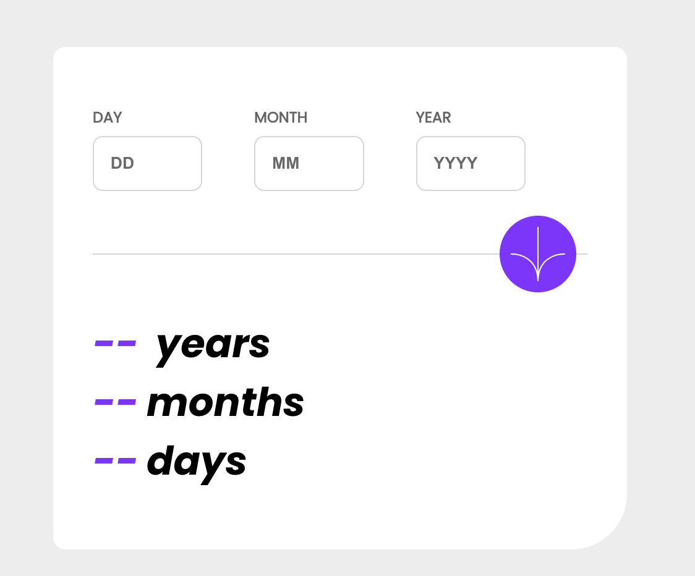

# Frontend Mentor - Age calculator app solution

This is a solution to the [Age calculator app challenge on Frontend Mentor](https://www.frontendmentor.io/challenges/age-calculator-app-dF9DFFpj-Q). Frontend Mentor challenges help you improve your coding skills by building realistic projects.

## Links

- Solution URL: [Add solution URL here]([https://your-solution-url.com](https://www.frontendmentor.io/solutions/age-calculator-app-in-react-with-input-validation-using-usestate-_FqfXZ1oxq)
- Live Site URL: [Add live site URL here]([https://your-live-site-url.com](https://szczepanieceryk.github.io/Frontend-Mentor-age-calculator-app/)
